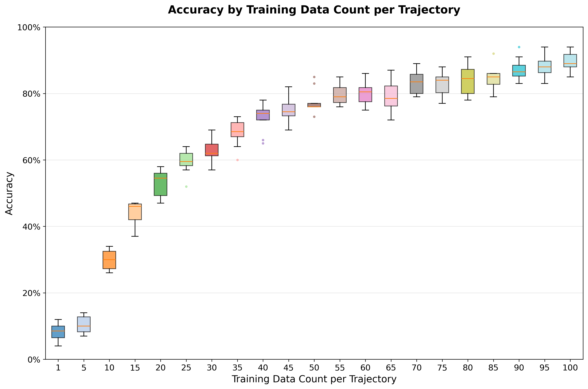
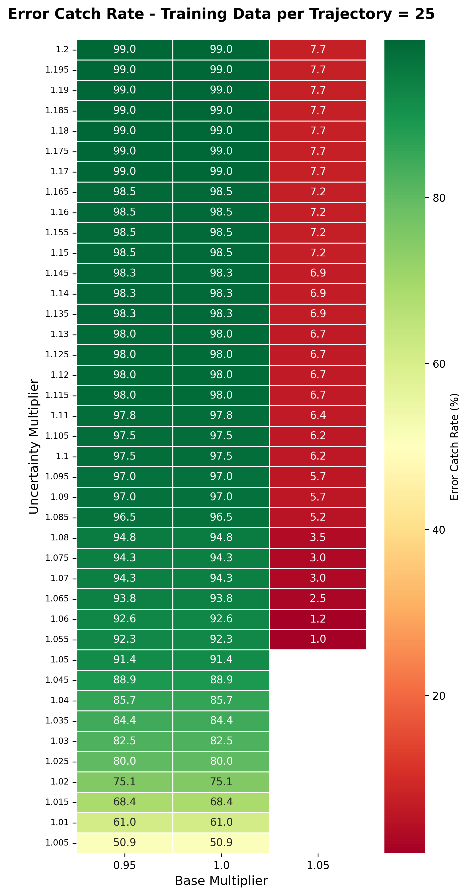
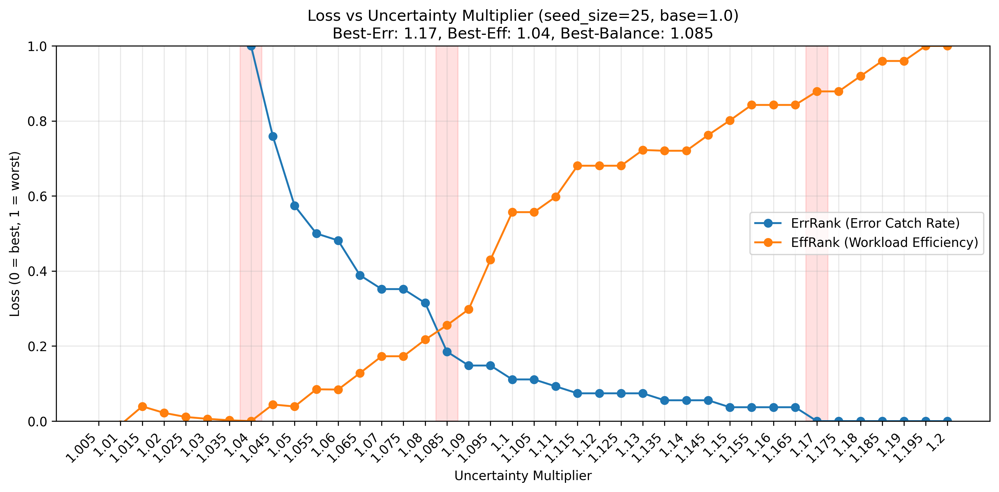
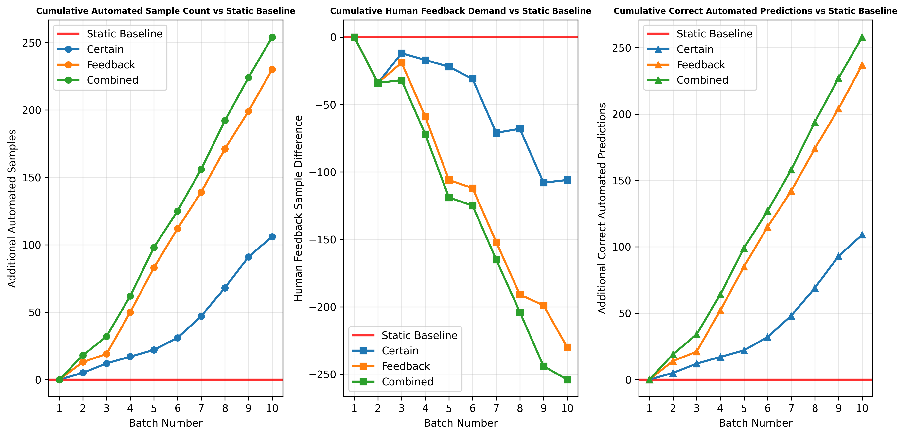
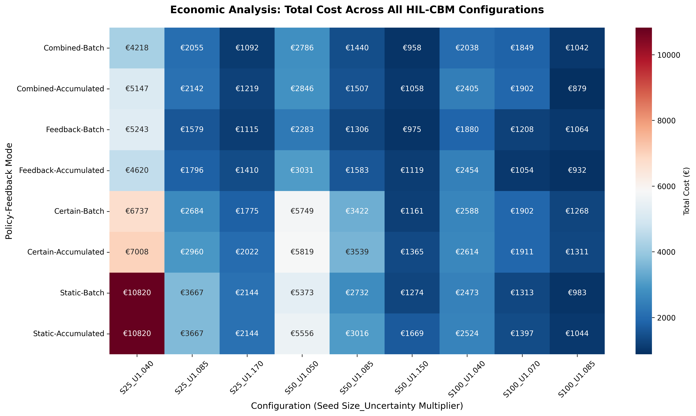
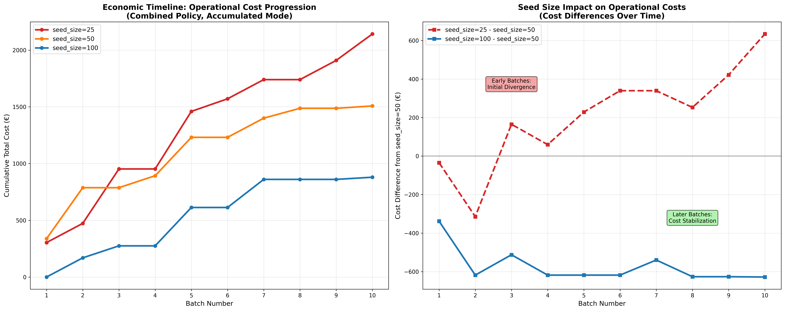

# HIL-CBM Framework for Cobots

Human-in-the-Loop Condition-Based Monitoring using collaborative robot sensor data. This repository contains the experimental implementation using Conv1D autoencoder neural networks with uncertainty quantification and cognitive load-based economic analysis.

## Research Overview

The HIL-CBM framework addresses the critical challenge of balancing automation and human oversight in industrial condition monitoring systems. Through a systematic experimental approach, this research evaluates the economic and performance trade-offs of different human-machine collaboration strategies.

### Key Research Questions

1. **Training Data Efficiency**: How does training data size affect diagnostic performance?
2. **Uncertainty Optimization**: What uncertainty thresholds optimize the balance between automation and human workload?
3. **Policy Comparison**: Which retraining strategies provide optimal long-term performance?
4. **Economic Analysis**: What are the economic implications of different HIL-CBM configurations?

## Data Availability

**Note**: Raw sensor data, processed datasets, trained models, and experimental results **cannot be published** due to proprietary restrictions.

### Required Data Format

To reproduce these experiments, you need:

**Training data** (3 files):
- `data_1_PAP1_1000.csv` - 1000 healthy cycles from trajectory PAP1
- `data_1_PAP2_1000.csv` - 1000 healthy cycles from trajectory PAP2
- `data_1_PAP3_1000.csv` - 1000 healthy cycles from trajectory PAP3

**Test data** (9 files):
- Normal: `data_1_PAP1.csv`, `data_1_PAP2.csv`, `data_1_PAP3.csv`
- Bottle neck: `data_1_PAP1_bottle.csv`, `data_1_PAP2_bottle.csv`, `data_1_PAP3_bottle.csv`
- Random noise: `data_1_PAP1_random.csv`, `data_1_PAP3_random.csv`
- Acceleration band: `data_1_PAP3_acc_band.csv`

**Data structure**:
- CSV files with 204 timesteps × 21 sensor variables per cycle (4284 features per row)
- Binary labels: 0=healthy, 1=unhealthy in `label` column
- Update `data_files` in `config.yaml` if using different file names

## System Requirements

- **Python**: 3.12 or higher

## Installation

```bash
pip install -r requirements.txt

# Create directories
mkdir -p data/raw data/processed data/stream results artifacts/models artifacts/docs

# Place raw CSV files in data/raw/, then run:
python src/data_preparation.py --config config.yaml
```

## Experimental Pipeline

### Data Processing and Preparation

**Raw Data Structure**: Industrial robot data from 3 operational trajectories (PAP1, PAP2, PAP3) with time-series sensor measurements:
- **Dimensions**: 204 timesteps × 21 sensor variables per operational cycle
- **Training Data**: 1000 healthy cycles per trajectory from normal operations
- **Test Data**: Mixed healthy/unhealthy cycles including failure modes:
  - Bottle neck scenarios (restricted flow)
  - Random noise injection (sensor degradation)
  - Acceleration band limits (mechanical constraints)

**Data Processing Logic**:

```math
\text{Sample Selection} = \begin{cases}
\text{Seed Data}: & \text{Stratified sampling from training data} \\
\text{Stream Data}: & \text{Holdout training + test data (shuffled)} \\
\text{Batch Processing}: & \text{Sequential 100-sample batches}
\end{cases}
```

**Preprocessing Steps**:
1. **Crop zero-rows**: Remove fully-zero feature rows from large training files
2. **Sample ID assignment**: Unique identifiers for traceability
3. **Stratified splitting**: Balanced representation across trajectories
4. **Stream randomization**: Random sampling with fixed seed (42) for reproducibility

### Core Architecture: 3-Zone Uncertainty Classification

The framework implements a **3-zone uncertainty classification system** based on Mean Absolute Error (MAE) thresholds:

```math
\text{Zone Classification} = \begin{cases}
\text{Zone 1 (Certain Healthy)}: & \text{MAE} \leq \tau_{base} \times m_{base} \\
\text{Zone 2 (Uncertain)}: & \tau_{base} \times m_{base} < \text{MAE} \leq \tau_{base} \times m_{unc} \\
\text{Zone 3 (Certain Unhealthy)}: & \text{MAE} > \tau_{base} \times m_{unc}
\end{cases}
```

Where:
- $\tau_{base}$: Base MAE threshold from training data
- $m_{base}$: Base multiplier (0.95, 1.00, 1.05)
- $m_{unc}$: Uncertainty multiplier (1.005-1.200)

**Priority Logic**: Multi-variable decision making using highest priority zone detection:

```math
\text{Final Prediction} = \begin{cases}
\text{Unhealthy} & \text{if } \exists j : \text{Zone}_j = 3 \text{ (any variable in Zone 3)} \\
\text{Uncertain} & \text{if } \exists j : \text{Zone}_j = 2 \text{ AND } \forall j : \text{Zone}_j \neq 3 \\
\text{Healthy} & \text{if } \forall j : \text{Zone}_j = 1 \text{ (all variables in Zone 1)}
\end{cases}
```

---

## Experiment 1: Training Data Scaling Analysis

**Objective**: Quantify the relationship between training data size and diagnostic performance to establish minimum training requirements.

### Methodology

**Model Architecture**: Conv1D autoencoder per variable with dropout regularization:

```math
\begin{aligned}
\text{Encoder}: & \quad x \rightarrow \text{Conv1D}(32, k=11, s=2) \rightarrow \text{Dropout}(0.1) \rightarrow \text{Conv1D}(16, k=11, s=2) \rightarrow z \\
\text{Decoder}: & \quad z \rightarrow \text{Conv1DTranspose}(16, k=11, s=2) \rightarrow \text{Dropout}(0.1) \rightarrow \text{Conv1DTranspose}(32, k=11, s=2) \\
& \quad \rightarrow \text{Conv1DTranspose}(1, k=11, s=1) \rightarrow \hat{x} \\
\text{Loss}: & \quad \mathcal{L} = \text{MSE}(\hat{x}, x) = \frac{1}{n}\sum_{i=1}^{n}(\hat{x}_i - x_i)^2
\end{aligned}
```

**Evaluation Protocol**:
- **Training sizes**: 1, 5, 10, 15, 20, 25, 30, 35, 40, 45, 50, 55, 60, 65, 70, 75, 80, 85, 90, 95, 100 samples per trajectory (21 configurations)
- **Test evaluation**: 10 batches × 100 samples each
- **Threshold calculation**: Maximum training MAE per variable (`np.max(mae)`)
- **Classification**: Binary decision (healthy/unhealthy) per trajectory using any-variable logic

### Results and Analysis

This experiment establishes the relationship between training dataset size and diagnostic performance, providing empirical bounds for data efficiency in autoencoder-based anomaly detection. Our results show that diagnostic performance exhibits logarithmic scaling with training data size, with diminishing marginal returns beyond a critical threshold of approximately 75 samples per trajectory.



*Training data scaling analysis across 21 configurations (1-100 samples per trajectory). Shows boxplot distribution of accuracy across all 3 trajectories and 10 test batches, demonstrating logarithmic performance scaling relationship.*

**Key Findings**:
- Minimum effective training size: ~25 samples per trajectory
- Performance plateau: >75 samples shows diminishing returns
- Variance reduction: Larger training sets provide more stable performance

### Running the Experiment

```bash
python src/experiment_1.py --config config.yaml
```

**What it does**: Trains autoencoder models for all 21 training sizes (1-100 samples), evaluates on 10 test batches

**Output files**:
- `results/experiment_1/ae_cycle_metrics.csv` - Raw accuracy data per training size
- `results/experiment_1/training_scaling_summary.csv` - Statistical summary
- `results/experiment_1/training_scaling_accuracy_boxplot.png` - Performance visualization

---

## Experiment 2: Uncertainty Optimization Analysis

**Objective**: Optimize uncertainty thresholds to balance automation rate with human workload efficiency while maintaining acceptable error rates.

### Methodology

**Parameter Space Exploration**:
- **Training sizes**: 25, 50, 100 samples per trajectory
- **Base multipliers**: 0.95, 1.00, 1.05 (threshold sensitivity)
- **Uncertainty multipliers**: 1.005-1.200 (step 0.005, 40 values)
- **Total configurations**: 3 × 3 × 40 = 360 combinations

**Performance Metrics**:

```math
\begin{aligned}
\text{Error Catch Rate} &= \frac{\text{Base AE Errors Flagged as Uncertain}}{\text{Total Base AE Errors}} \times 100 \\
\text{Workload Efficiency} &= \frac{\text{Base AE Errors Flagged as Uncertain}}{\text{Total Uncertain Samples}} \times 100 \\
\text{Human Workload} &= \frac{\text{Uncertain Samples}}{\text{Total Samples}} \times 100
\end{aligned}
```

**Metric Definitions**:
- **Base AE Predictions**: Binary classification using original autoencoder thresholds (`np.any(mae_scores > base_thresholds)`)
- **Base AE Errors**: Cases where base autoencoder prediction differs from ground truth
- **Error Catch Rate**: Fraction of base AE errors successfully identified as uncertain (safety metric)
- **Workload Efficiency**: Fraction of uncertain samples that correspond to actual base AE errors (productivity metric)

**Selection Strategies**:
- **best_err**: Maximize error catch rate (safety-critical applications)
- **best_eff**: Maximize workload efficiency (productivity optimization)
- **best_balance**: Balance both objectives with minimum thresholds

### Results and Analysis

This experiment conducts comprehensive parameter space optimization across 360 configurations to establish Pareto-optimal uncertainty thresholds. The analysis reveals that application-specific uncertainty threshold selection significantly impacts the fundamental trade-off between error catch rate (safety) and automation rate (efficiency), with distinct optimal regions for different industrial applications.



*Error catch rate heatmap for seed_size=25 across 120 configurations (3 base multipliers × 40 uncertainty multipliers). Shows percentage of base autoencoder errors successfully flagged as uncertain, optimized for safety-critical applications.*

**Selection Logic**: For each training size, we identify three optimal configurations:



*Optimization strategy selection for seed_size=25, base_multiplier=1.00. Compares best_err (safety-focused) vs best_eff (productivity-focused) strategies across 40 uncertainty multiplier values, showing trade-off between error catch rate and workload efficiency.*

**Key Findings**:
- **Safety-critical applications**: Use best_err strategy (higher uncertainty multipliers)
- **Productivity-focused applications**: Use best_eff strategy (lower uncertainty multipliers)
- **Balanced applications**: Use best_balance strategy (moderate uncertainty multipliers)

### Running the Experiment

```bash
python src/experiment_2.py --config config.yaml
```

**What it does**: Tests all 360 uncertainty threshold combinations (3 seed sizes × 3 base multipliers × 40 uncertainty multipliers), selects optimal configurations

**Output files**:
- `results/experiment_2/uncertainty_optimization_summary.csv` - All 360 configuration results
- `results/experiment_2/selected_multipliers_base_1.00.csv` - Optimal thresholds for Experiment 3
- `results/experiment_2/error_catch_rate_seed_size_*.png` - Safety-focused heatmaps
- `results/experiment_2/workload_efficiency_seed_size_*.png` - Efficiency-focused heatmaps
- `results/experiment_2/rankplot_seed_size_*_base_1.00.png` - Selection strategy visualization

---

## Experiment 3: Policy Comparison Analysis

**Objective**: Evaluate different human-in-the-loop retraining strategies to quantify the long-term benefits of continuous learning versus static operation.

### Methodology

**Policy Framework**: Four distinct retraining strategies tested across all configurations:

```math
\text{Policy Matrix} = \begin{cases}
\text{Static}: & \text{No retraining (baseline)} \\
\text{Certain}: & \text{Retrain with Zone 1 samples only} \\
\text{Feedback}: & \text{Retrain with human feedback on Zone 2 samples} \\
\text{Combined}: & \text{Retrain with both Zone 1 + Zone 2 feedback}
\end{cases}
```

**Retraining Logic**:

```math
\begin{aligned}
\text{Certain Collection}: & \quad S_{certain} = \{x_i : \text{ALL zones}_i = 1 \text{ AND } \text{final\_prediction}_i = \text{healthy}\} \\
\text{Feedback Collection}: & \quad S_{feedback} = \{x_i : \text{Zone}_i = 2 \text{ AND feedback\_label}(x_i) = \text{healthy}\} \\
\text{Accumulated Training}: & \quad D_{new} = D_{initial} \cup S_{certain} \cup S_{feedback}
\end{aligned}
```

**Feedback Modes**:
- **Batch**: Immediate feedback per batch (reactive)
- **Accumulated**: Feedback when threshold reached (proactive, default: 30 samples)

**Experimental Design**:
- **Total configurations**: 3 seed_sizes × 3 selection_strategies × 4 policies × 2 feedback_modes = 72 experiments
- **Evaluation**: 10 sequential batches showing temporal performance evolution
- **Human feedback**: 100% accurate simulation (oracle assumption)

### Results and Analysis

This experiment evaluates the temporal evolution of system performance under different human-in-the-loop learning paradigms. The analysis examines three key aspects: cumulative automation rate, human feedback demand, and prediction accuracy improvement over time. Results show that continuous learning policies, particularly the Combined approach, exhibit statistically significant performance improvements over static baselines, with cumulative benefits increasing over extended operational periods.



*Policy performance comparison for seed_size=25, uncertainty_multiplier=1.085, accumulated feedback mode. Shows cumulative automated samples, human feedback demand, and correct predictions vs Static baseline across 10 operational batches.*

**Key Insights**:
- **Static baseline**: Performance degrades over time due to distribution drift
- **Certain policy**: Modest improvement from high-confidence samples
- **Feedback policy**: Significant improvement from human guidance on uncertain cases
- **Combined policy**: Best performance combining both learning sources

**Performance Metrics**:

```math
\begin{aligned}
\text{Automation Improvement} &= \text{Certain}_{policy} - \text{Certain}_{static} \\
\text{Feedback Efficiency} &= \frac{\text{Accuracy Gain}}{\text{Human Feedback Required}} \\
\text{Cumulative Benefit} &= \sum_{t=1}^{10} (\text{Performance}_{t,policy} - \text{Performance}_{t,static})
\end{aligned}
```

### Running the Experiment

**Option 1: Single Configuration (for testing)**
```bash
python src/experiment_3.py --seed_size 25 --selection_strategy best_balance --certain_retraining true --feedback_retraining false --feedback_mode accumulated
```

**Option 2: Complete Grid Run (recommended)**
```bash
# Run all 72 configurations automatically
bash experiment_3_grid_runner.sh

# Then generate visualizations
python src/experiment_3_visualization.py --config config.yaml
```

**What the grid runner does**: Systematically runs all 72 policy combinations (3 seed sizes × 3 strategies × 4 policies × 2 feedback modes)

**What visualization does**: Creates temporal comparison plots for all configurations showing policy performance vs static baseline

**Key flags**:
- `--skip_existing`: Skip configurations that already have results (useful for resuming interrupted runs)

**Output files**:
- `results/experiment_3/policy_experiment_*.json` - 72 detailed experiment files (one per configuration)
- `results/experiment_3/plots/seed_size_*/` - Policy comparison plots organized by seed size
- `results/experiment_3/experiment_3_overall_performance.png` - Summary visualization

---

## Experiment 4: Economic Analysis

**Objective**: Quantify the economic implications of different HIL-CBM configurations using cognitive load theory to provide practical decision-making support for industrial implementation.

### Economic Model

**3-Component Cost Model**: Complete economic analysis incorporating human factors:

```math
C_{total} = C_{interface} + C_{opportunity} + C_{error}
```

**1. Interface Cost (Cognitive Load Model)**:
```math
\begin{aligned}
T_{req,j} &= t_{feed} \times N_{feed,j} \times (1 + \gamma \times (e^{\delta(N_{feed,j}-1)} - 1)) \\
C_{interface} &= \left(\sum_{j=1}^{N_{req}} T_{req,j} + N_{req} \times t_{walk}\right) \times C_w
\end{aligned}
```

Where:
- $t_{feed}$: Base feedback time (0.5 min)
- $\gamma$: Cognitive overhead weight (0.3)
- $\delta$: Exponential growth rate (0.04)
- $N_{feed,j}$: Feedback items in request j
- $t_{walk}$: Walking time per request (3 min)
- $C_w$: Operator wage (€1/min, canonical value)

**2. Opportunity Cost**:
```math
C_{opportunity} = \text{Total Interface Time} \times \frac{v}{\tau}
```

**3. Error Cost** (FP more costly than FN):
```math
\begin{aligned}
C_{FP} &= t_{maint} \times \left(C_w + \frac{v}{\tau}\right) \\
C_{FN} &= v \times (1 + 0.2) \\
C_{error} &= N_{FP} \times C_{FP} + N_{FN} \times C_{FN}
\end{aligned}
```

Where:
- $t_{maint}$: Maintenance time per false positive (60 min)
- $v$: Value of finished product (€20/unit)
- $\tau$: Production time per unit (12 min/unit)

### Experimental Design and Configuration Selection

**Configuration Selection Methodology**: The economic analysis employs three distinct analytical approaches, each designed with specific configuration selections to isolate and examine different economic factors while minimizing confounding variables.

**1. Economic Landscape Analysis - Complete Parameter Space**
- **Configuration Scope**: All 72 experimental configurations from Experiment 3
- **Research Rationale**: Comprehensive analysis requires examination of the entire parameter space to identify global cost-performance trade-offs and establish complete economic landscape mapping
- **Methodological Justification**: This approach ensures no optimal configurations are overlooked and provides robust statistical foundation for economic decision-making across all possible system configurations

**2. Seed Size Impact Analysis - Controlled Comparison**
- **Selected Configuration**: Combined policy, uncertainty_multiplier=1.085, accumulated feedback mode
- **Research Rationale**: The Combined policy represents the most sophisticated learning strategy, demonstrating maximum potential for operational improvement over time
- **Fixed Parameters Justification**: Using identical uncertainty_multiplier (1.085) and feedback mode (accumulated) across all seed sizes eliminates confounding effects, isolating seed size impact on operational costs
- **Seed Size Comparison**: 25 vs 50 vs 100 samples provides clear demonstration of how initial model quality affects operational error rates and costs

**3. Human Factors Analysis - Representative Configuration**
- **Selected Configuration**: seed_size=50, uncertainty_multiplier=1.085, Feedback policy only
- **Research Rationale**: Feedback policy selected as the most human-dependent strategy, maximizing sensitivity to cognitive load variations
- **Median Parameters Justification**: seed_size=50 represents the middle configuration, avoiding extreme cases that might mask cognitive effects
- **Single Policy Focus**: Isolating one policy type prevents policy-specific effects from confounding cognitive load measurements
- **Cognitive Parameter Range**: Expert-to-novice skill spectrum (10 levels) provides comprehensive assessment of operator expertise impact on economic outcomes

**Methodological Validity**: Each analysis type employs targeted configuration selection to address specific research questions while controlling for variables that could obscure the phenomena under investigation. This approach ensures clear causal attribution between configuration parameters and economic outcomes.

### Analysis Types

#### 1. Economic Landscape Analysis
This analysis provides a comprehensive economic assessment across all 72 experimental configurations from Experiment 3, evaluating total cost and terminal accuracy to establish the complete cost-performance landscape. The results quantify significant economic differentiation between HIL-CBM policies, establishing distinct cost-accuracy trade-off frontiers for industrial deployment decisions.



*Complete cost analysis across all 72 HIL-CBM configurations: 3 seed sizes × 3 optimal uncertainty multipliers × 4 policies × 2 feedback modes, calculated using cognitive load-based cost model with fixed parameters (t_feed=0.5min, γ=0.3, δ=0.04).*

**Selection Logic**: We analyze the complete experimental space (all Experiment 3 configurations) to identify:
- **Lowest cost configurations**: Minimum economic investment across all policies
- **Highest accuracy configurations**: Maximum performance from production system metrics
- **Most efficient configurations**: Best accuracy-per-euro ratio using cumulative 10-batch costs

#### 2. Seed Size Impact Analysis
This analysis examines how initial model quality (determined by seed size) affects operational costs over time. The results demonstrate that better-trained models (higher seed sizes) achieve lower cumulative costs through reduced error rates, with cost differences accumulating across operational batches.



*Seed size impact analysis using SPECIFIC CONFIGURATION: Combined policy, uncertainty_multiplier=1.085 (fixed across all seed sizes), accumulated feedback mode. Compares seed_size=25 vs 50 vs 100 showing cumulative operational cost progression across 10 batches.*

**Analysis Logic**:
- **Early batches**: Cost differences emerge due to varying error rates across seed sizes
- **Middle batches**: Better-trained models demonstrate operational advantages through fewer errors
- **Later batches**: Cumulative cost benefits of higher seed sizes become evident
- **Cost divergence**: Models with different seed sizes show different operational cost trajectories

**Economic Insight**:
```math
\text{Cost Trajectory} = \sum_{i=1}^{n} \left(C_{interface,i} + C_{opportunity,i} + C_{error,i}\right)
```

#### 3. Human Factors Analysis
This analysis provides a quantitative assessment of how operator cognitive capabilities impact optimal feedback strategy selection, incorporating established cognitive load theory into industrial decision-making frameworks. The results establish that operator expertise level serves as a critical determinant for feedback strategy optimization, with statistically significant cost differentials between batch and accumulated approaches.

**Cognitive Parameter Modeling**:
```math
\text{Skill Level} \rightarrow \begin{cases}
t_{feed} &= 0.25 + \text{skill\_factor} \times 0.6 \text{ (expert: 0.25, novice: 0.85)} \\
\gamma &= 0.05 + \text{skill\_factor} \times 0.6 \text{ (expert: 0.05, novice: 0.65)} \\
\delta &= 0.015 + \text{skill\_factor} \times 0.07 \text{ (expert: 0.015, novice: 0.085)}
\end{cases}
```

**Theoretical Integration**: Expert operators demonstrate minimal performance difference between feedback modes due to efficient cognitive task-switching capabilities, while novice operators achieve optimal performance through batch feedback strategies that minimize cognitive overhead associated with context switching and working memory limitations, particularly evident in later operational batches (6-10).


*Human factors analysis using SPECIFIC CONFIGURATION: seed_size=50, uncertainty_multiplier=1.085, Feedback policy only. Compares 10 skill levels from Expert (Level 1: t_feed=0.25min, γ=0.05, δ=0.015) to Novice (Level 10: t_feed=0.85min, γ=0.65, δ=0.085). Shows total cost difference (batch - accumulated) over complete 10-batch operational period.*

**Key Cognitive Load Findings**:
- **Expert operators**: Minimal cost difference between feedback modes (accumulated mode slightly favored)
- **Novice operators**: Batch mode significantly more cost-effective, especially in batches 6-10
- **Cognitive overhead**: Novices benefit from reduced context switching in batch processing
- **Industrial implication**: Operator skill level critical for optimal feedback strategy selection

### Running the Experiment

```bash
python src/experiment_4.py --config config.yaml
```

**What it does**: Loads all 72 experiment results from Experiment 3, calculates economic costs using cognitive load model, generates comprehensive economic analysis

**Prerequisites**: Experiment 3 must be completed first (requires the 72 JSON result files)

**Output files**:
- `results/experiment_4/comprehensive_cost_dataset.csv` - All economic data for 72 configurations
- `results/experiment_4/economic_landscape_cost_heatmap.png` - Total cost overview
- `results/experiment_4/economic_landscape_accuracy_heatmap.png` - Accuracy overview
- `results/experiment_4/training_investment_analysis.png` - Seed size impact on operational costs
- `results/experiment_4/human_factors_cognitive_analysis.png` - Operator skill impact on costs
- `results/experiment_4/economic_analysis_summary.txt` - Statistical summary and key insights

### Key Economic Findings

1. **Seed Size Impact**: Higher seed sizes (50, 100) show lower operational costs due to reduced error rates
2. **Policy Economics**: Combined policy demonstrates best long-term cost-effectiveness through continuous learning
3. **Human Factors**: Operator skill level critical for feedback strategy selection (batch vs accumulated)
4. **Industrial Decision Support**: Framework provides quantitative basis for HIL-CBM implementation decisions

---

## Results Structure

```
results/
├── experiment_1/
│   ├── ae_cycle_metrics.csv                    # Raw accuracy data per training size
│   ├── training_scaling_summary.csv           # Statistical summary
│   └── training_scaling_accuracy_boxplot.png  # Performance visualization
├── experiment_2/
│   ├── uncertainty_optimization_summary.csv   # All 360 configuration results
│   ├── selected_multipliers_base_1.00.csv    # Optimal thresholds for Experiment 3
│   ├── error_catch_rate_seed_size_*.png       # Safety-focused heatmaps
│   ├── workload_efficiency_seed_size_*.png    # Efficiency-focused heatmaps
│   └── rankplot_seed_size_*_base_1.00.png     # Selection strategy visualization
├── experiment_3/
│   ├── policy_experiment_*.json               # 72 detailed experiment files
│   └── plots/
│       ├── seed_size_25/                      # Policy comparison plots
│       ├── seed_size_50/
│       ├── seed_size_100/
│       └── experiment_3_overall_performance.png
└── experiment_4/
    ├── comprehensive_cost_dataset.csv          # All economic data
    ├── economic_landscape_cost_heatmap.png     # Cost overview
    ├── economic_landscape_accuracy_heatmap.png # Accuracy overview
    ├── training_investment_analysis.png        # Seed size impact analysis
    ├── human_factors_cognitive_analysis.png    # Operator skill impact
    └── economic_analysis_summary.txt           # Statistical summary
```

